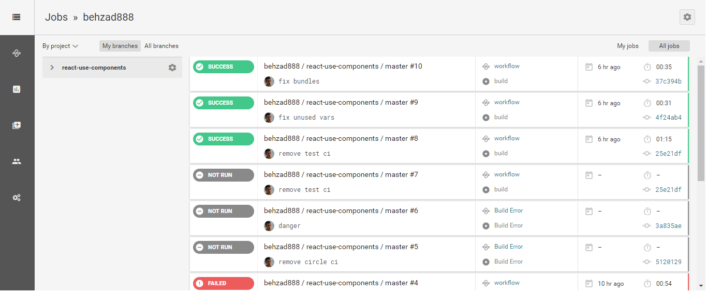

There are many steps that every front-end developers and maintainers should know, they are:
 - [How to format codes](https://overafaik.com/formatting-codes)
 - [How to report on patterns found in ECMAScript/JavaScript code](https://overafaik.com/linting-codes)
 - [How to check object types](https://overafaik.com/flow-type-check)
 - [How to test everything](https://overafaik.com/jest)
 - [How to build the project](https://overafaik.com/build-project)
 - [How to use CI](https://overafaik.com/continous-integration)
 - How forced contributors to staying on contributing guidelines?


## What is What is Continuous Integration (CI) and how to use it?
Continuous Integration is the practice of merging in small code changes frequently - rather than merging in a large change at the end of a development cycle. The goal is to build healthier software by developing and testing in smaller increments.

There are many CI system that we can use it but I want to show you how to use [Circle CI](https://circleci.com/). Although, it has a powerful [documentation](https://circleci.com/docs/2.0/).

To start using Circle CI, make sure you have:
 - A GitHub account and signup in circleci.com.
 - Owner permissions for a project hosted on GitHub.
 - To have a `.circleci/config.yml` file and commit it.
   ```
      version: 2
      jobs:
        build:
          docker:
            - image: circleci-image
          
          parallelism: [column count]

          steps:
            - checkout

            - run: echo $CIRCLE_COMPARE_URL | cut -d/ -f7

            - run:
              name: Nodejs Version
              command: node --version

            - run:
              name: [Command Name]
              command: [command]
            
             - store_artifacts
            ...

   ``` 
Note: To using specific version of node you can use [nvm](https://github.com/creationix/nvm) (Node Version Manager) - Simple bash script to manage multiple active node.js versions. Optionally, your repository can contain a `.nvmrc` file in the repository root to specify which *single version* of Node.js to run your tests against.

Next, To add a project and build with circle CI you can add or `Follow` github repository in [dashboard](https://circleci.com/dashboard).

Finally, all steps will be run after commits.

