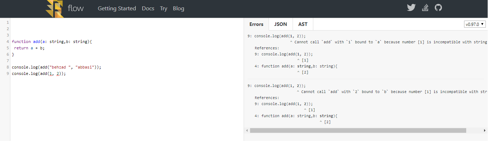

There are many steps that every front-end developers and maintainers should know, they are:
 - [How to format codes](https://overafaik.com/formatting-codes)
 - [How to report on patterns found in ECMAScript/JavaScript code](https://overafaik.com/linting-codes)
 - [How to check object types](https://overafaik.com/flow-type-check)
 - [How to test everything](https://overafaik.com/jest)
 - [How to build the project](https://overafaik.com/build-project)
 - [How to use CI](https://overafaik.com/continous-integration)
 - How forced contributors to staying on contributing guidelines?

## How to check object types

I always have been thinking about `any` type in javascript and typescript and I was tired of having to run codes to find bugs until I heard about [Flow](https://flow.org/).

> **Flow identifies problems as you code.**

So, What's it doing for us? Let me show you something:

```js
function Add(a, b) {
  return a + b;
}

concat("foo", "bar"); // Works!
concat(1, 2);         // Works!
```
This is a super simple function in javascript and I want to use it in my code. but, I dont know what is it. Its a `concat` function or its a `sum` function. Ok! I can use `@babel/plugin-transform-flow-strip-types`  

```js
function Add(a, b) {
  return a + b;
}

concat("foo", "bar"); // Works!
concat(1, 2);         // Works!
```
But! it also works!

Let me try another way. Lets use babel `flow` pragma.
```js
function Add(a, b) {
  return a + b;
}

concat("foo", "bar"); // Works!
concat(1, 2);         // Works!
```
It still works!

Now, how *Flow* can solve my problem?
see [this console](https://flow.org/try/#0FAhmFcDsGMBcEsD2kAEBDAJhgFGgXCgM6wBO8kA5gDQBGBxZlAlAN7AokCms4JqaKANQoaAbmABfENGSFEAG04A6eYgq4s2AEQ1OACwBemFFqom0NGmkLwtTJuJmQ5ilWo04AjGYBM90UA)



As you see, there is really problem with this sample. Before we start, install `babel-cli `, `babel-preset-flow` and `flow-bin`. 

The Flow background process monitors all Flow files. However, how does it know which files are Flow files and, thus, should be checked? Placing the following **before any code** in a JavaScript file is the flag the process uses to answer that question.

> // @flow or /* @flow */

Every Flow project contains a `.flowconfig` file. You can configure Flow by modifying `.flowconfig`.
```
//.flowconfig

[ignore] //ignore files 
 ...

[include] //include certain files
 ...

[libs] //include your lib files
 //this section tells Flow to include the specified library definitions when type checking your code.
 ...

[lints] //linter
//Flow contains a linting framework that can tell you about more than just type errors
 ...

[options] //Flow's various options
 ...
```
for options please see https://flow.org/en/docs/config/options/

But I'd like to use another way. so, create `flowconfig` file wherever you want and then set your configurations. In this way we need to run it by `node js`. I want to split my project and flow them separately. Lets begin.

> Note that `flowconfig` is the same with `.flowconfig`.

First, define your sections as below:

```
module.exports = [
  {
    shortName: 'dom',
    isFlowTyped: true,    
  },
  {
    shortName: 'test',
    isFlowTyped: true,    
  },
  {
    shortName: 'custom',
    isFlowTyped: true,    
  },
];

```

Next, create a flow config creator as below:

```js
// flow config creator
const chalk = require('chalk');
const fs = require('fs');
const mkdirp = require('mkdirp');
const inlinedConfigs = require('./inlinedConfigs');

const configTemplate = fs
  .readFileSync(__dirname + '/config/flowconfig')
  .toString();

function writeConfig(renderer) {
  const folder = __dirname + '/' + renderer;
  mkdirp.sync(folder);

  const config = configTemplate.replace(
    '%RENDERER_FLOW_OPTIONS%',
    `
module.name_mapper='plugin1/inline.${renderer}$$' -> 'plugin1/inline-typed'
module.name_mapper='plugin2/inline.${renderer}$$' -> 'plugin1/inline-typed'
    `.trim(),
  );

  const disclaimer = `
# ---------------------------------------------------------------#
# NOTE: this file is generated.                                  #
# Then run Yarn for changes to take effect.                      #
# ---------------------------------------------------------------#
  `.trim();

  const configFile = folder + '/.flowconfig';
  let oldConfig;
  try {
    oldConfig = fs.readFileSync(configFile).toString();
  } catch (err) {
    oldConfig = null;
  }
  const newConfig = `
    ${disclaimer}
    ${config}
    ${disclaimer}
  `.trim();

  if (newConfig !== oldConfig) {
    fs.writeFileSync(configFile, newConfig);
    console.log(chalk.dim('Wrote a Flow config to ' + configFile));
  }
}

// Write multiple configs in different folders
// so that we can run those checks in parallel if we want.
inlinedHostConfigs.forEach(rendererInfo => {
  if (rendererInfo.isFlowTyped) {
    writeConfig(rendererInfo.shortName);
  }
});

```
Finally, we just need to run it by script command line.

```json
//package.json
"scripts":{
  "flow": "node ./tasks/flow.js [dom | custom | test]",
}
```

```js
//flow.js
const chalk = require('chalk');
const spawn = require('child_process').spawn;

require('./flowConfigCreator');

async function runFlow(renderer, args) {
  return new Promise(resolve => {
    console.log(
      'Running Flow on the ' + chalk.yellow(renderer) + ' renderer...',
    );
    let cmd = __dirname + '/../../node_modules/.bin/flow';
    if (process.platform === 'win32') {
      cmd = cmd.replace(/\//g, '\\') + '.cmd';
    }
    spawn(cmd, args, {
      // Allow colors to pass through:
      stdio: 'inherit',
      // Use a specific renderer config:
      cwd: process.cwd() + '/flow/' + renderer + '/',
    }).on('close', function(code) {
      if (code !== 0) {
        console.error(
          'Flow failed for the ' + chalk.red(renderer) + ' renderer',
        );
        console.log();
        process.exit(code);
      } else {
        console.log(
          'Flow passed for the ' + chalk.green(renderer) + ' renderer',
        );
        resolve();
      }
    });
  });
}
module.exports = runFlow;
```

I know. **Its amazing! :)**
Really, I hope it would be useful.

Wait a minute, I lost something!!! What about *Flow*? No problem. You can see Flow documentation :| or stay here to see how can I use it.

Well, Lets see more useful things that we need to know about **Flow**.

#### [Type Annotations](https://flow.org/en/docs/types/)

> Type annotations is an important part of interaction with Flow.

Simple example:
```js
/* @flow */
function square (n: number) {
  return n * n
}

const four = square(2)
```
Most of what you need to do is to simply add annotations to function arguments!

Type inference:
```js
function square (n: number) {
  const result = n * n
}
```
Result is inferred to be a number because number * number will result in a number. There’s no need to give it annotations.

Opaque Type Aliases:
```js
type Person = {
  name: string,
  age: number,
  isAdmin: boolean,
  likes: Array<string>
}

function greet(user: Person) {
  console.log('hello', user.name)
}
 
greet({ name: 'Behzad Abbasi', ··· })
// Generic
type Tree = {
  foo: string,
  bar: number,
  qux: (foo: string, bar: number) => boolean
}

type Generic<T> = {
  foo: T
}

```
This is the typical way to define the shape of complex objects.

Variables:
```js
const count: number = 200
```
You typically don’t need to do this, function args are often enough.

Module Types:
```js
import type { Person } from './types'
export type Person = {
  ···
}
```
It is often useful to share types in between modules (files).

```js
type Action = number | string
type Direction = 'left' | 'right'

function toStringPrimitives(value: number | boolean | string) {
  return String(value);
}
```
Sometimes it’s useful to create a type which is one of a set of other types.

Maybe types:
```js
type Album = {
  name: ?string
}

const a: Album = { }                 // ✗ Error
const a: Album = { name: 'Blue' }    // ✓ OK
const a: Album = { name: null }      // ✓ OK
const a: Album = { name: undefined } // ✓ OK
```
This makes name either a string or null.

Optional properties:
```js
type Album = {
  name?: string
}

const a: Album = { } // ✓ OK
a.name = 'Blue'      // ✓ OK
a.name = null        // ✗ Error
a.name = undefined   // ✓ OK
```
This makes an Album valid even if name is not part of the keys. This is different from *maybe* types.

Dynamic keys:
```js
type Items = {
  [key: string]: Item
}
```
> For objects like these, Flow provides a special kind of property, called an *indexer property.* An indexer property allows reads and writes using any key that matches the indexer key type.

So,

Primitives:
```js
any	 
boolean	 
mixed	 
number	 
string	 
void //undefined
null //null (but not undefined)
{a: Number} //Object with a shape
[any, number]	//Tuples (fixed-length arrays)
Array<T>	 
Class<T>	 
Function	 
Object	 
?number	//Maybe (number, void, null)
a | b	//Union types
```

Enums:
```js
type Suit = "Diamonds" | "Clubs" | "Hearts" | "Spades"

const countries = {
  US: "United States",
  IT: "Italy",
  FR: "France",
  NL: "Netherlands",
}

type Country = $Keys<typeof countries>
```

Generic classes:
```js
class GenericClass<T> {
  x: T
  constructor (x: T) { ... }
}

var n: GenericClass<number> = new GenericClass(0)
```

Functions:
```js
const callback: () => void = function () {}
function filter<T> (
  list: Array<T>,
  callback: (item: T) => boolean
): Array<T> {
  ···
}
```

#### [Type system](https://flow.org/en/docs/lang/)

> Developers like coding in JavaScript because it helps them move fast. The language facilitates fast prototyping of ideas via dynamic typing. The runtime provides the means for fast iteration on those ideas via dynamic compilation. This fuels a fast edit-refresh cycle, which promises an immersive coding experience that is quite appealing to creative developers.

Extra object fields:
```js
type Artist = {
  name: string,
  label: string
}

const a: Artist = {
  name: 'Freddie Mercury',
  label: 'Bohemian Rhapsody'
}

a.genre = 'Rock' // ✓ OK
```

Exact object types:
```js
type Artist = {|
  name: string,
  label: string
|}

const a: Artist = { ··· }
a.genre = 'Rock' // ✗ Error
```
Exact object types prevent extra properties from being added to an object.

These examples could be used as cheatsheet too.

#### [Flow Stricts](https://flow.org/en/docs/strict/)

> You can enable stronger safety guarantees in Flow (such as banning `any`/`Object`/`Function` types and requiring all dependencies to be typed) by adding `@flow strict` to your files.

```
//.flowconfig
[strict]
nonstrict-import //Triggers an error when importing from a module which is not also `@flow strict`
unclear-type //Triggers an error when using `Object`, `Function`, or `any` in a type annotation.
unsafe-getters-setters //Triggers an error when using getters and setters, which can be unsafe.
untyped-import //Triggers an error when importing from an untyped module.
untyped-type-import //Triggers an error when importing a type from an untyped module.
sketchy-null //Triggers an error when doing an existence check on a value that could be null/undefined or falsey. This can be optional because it may be too noisy in some codebases
```

#### [Flow Linting](https://flow.org/en/docs/linting/)

> Flow contains a linting framework that can tell us about more than just type errors.

```
//.flowconfig
[lints]
untyped-type-import=error
```
Its enough for me. 

#### [React](https://flow.org/en/docs/react/)

> Developers will often use Flow and React together, so it is important that Flow can effectively type both common and advanced React patterns.

Whats that mean? see

```js
type Props = {
  bar: number,
}

type State = {
  open: boolean,
}

class Foo extends React.Component<Props, State> {
  // Component code
}
```

We can check props and state types and Its helpful to me.